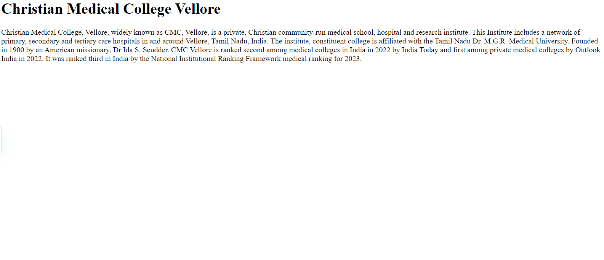
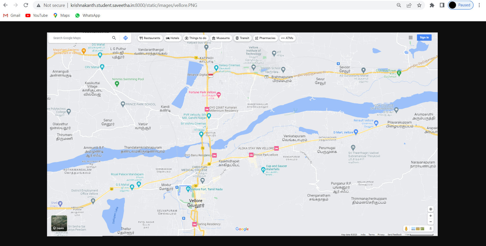

# Places Around Me

## AIM:
To develop a website to display details about the places around my house.

## Design Steps:

### Step 1:
clone the github repository into the IDE

### Step 2:
create a django project

### step 3:
write the needed HTML code 

### step 4:
run the django server and excute the HTML files


## Code:
```

<map name="image-maps-2023-07-26-054901" id="ImageMapsCom-image-maps-2023-07-26-054901">
<area  alt="" title="vellorefort" href="vellorefort.html" shape="rect" coords="630,736,680,786" style="outline:none;" target="_self"     />
<area  alt="" title="cmc" href="cmc.hrml" shape="rect" coords="712,674,762,724" style="outline:none;" target="_self"     />
<area  alt="" title="vit" href="vit.html" shape="rect" coords="953,137,1003,187" style="outline:none;" target="_self"     />
<area  alt="" title="GGR" href="GGR.html" shape="rect" coords="1615,346,1665,396" style="outline:none;" target="_self"     />
<area  alt="" title="katpadi" href="katpadi.html" shape="rect" coords="723,104,773,154" style="outline:none;" target="_self"     />
<area shape="rect" coords="1843,963,1845,965" alt="Image Map" style="outline:none;" title="Image Map" href="https://www.image-maps.com/" />
</map>

GGG.html


<!DOCTYPE html>
<html>
<head>
    <title> GGR </title>
</head>

<BODY>
    <h1>
      G.G.R.College of Engineering
Chennai Bangalore Highway, Perumugal, Vellore PIN 632 0
Vellore(Dt)  -  Tamilnadu
    </h1>
    <p>
       Ggr College of Engineering (GCE) located at Chennai-Bangalore Highway,
       Pillaiyarkuppam,Perumugai,Vellore  Tamil Nadu is one of the popular colleges in India.
       
       The College has been rated by 11 people on iCBSE.
       The Ggr College of Engineering has been viewed 57 times by the visitors on iCBSE.
       
       This College is counted among the top-rated Colleges in Tamil Nadu with an excellent academic track record. 
    </p>
</BODY>


</html>

katpadi.html


<!DOCTYPE html>
<html>
<head>
    <title> KATPADI </title>
</head>

<BODY>
   
    <p>
       Katpadi  is a locality in Vellore, at the northern part of Vellore city in the state of Tamil Nadu, India.

       Once a village, Katpadi was upgraded to a panchayat town, with its own taluk office. It has a major
        assembly constituency which is part of Arakkonam (Lok Sabha constituency).
        
    </p>
</BODY>


</html>

vellorefort.html

<!DOCTYPE html>
<html>
    <head>
        <title>
            VELLORE FORT 
        </title>
    </head>
    <body>
        <h1> Vellore Fort is a large 16th-century fort situated in heart of the Vellore city </h1>
        <p>
            In the state of Tamil Nadu, India built by Vijayanagara kings.

            The fort was at one time the headquarters of the Aravidu Dynasty of the Vijayanagara Empire.

            The fort is known for its grand ramparts, wide moat and robust masonry.

            Vellore Fort was built by Chinna Bommi Reddy and Thimma Reddy Nayak, subordinate chieftains under 
            Sadasiva Raya of the Vijayanagara Empire in the year of 1566 AD.

            The fort is situated in the centre of Vellore town opposite to the Old Bus stand.
            Vellore is on the Chennai-Bangalore highway and is 120 km (75 mi) from Chennai and 210 km (130 mi) from Bangalore. 
        </p>
    </body>
</html>

vit.html


<!DOCTYPE html>
<html>
<head>
    <title> VIT</title>
</head>

<BODY>
    <h1>
        Vellore institute of technology
    </h1>
    <p>
        Vellore Institute of Technology (VIT) is a private research deemed university located in Katpadi in Vellore, Tamil Nadu, India.
        
        The institution offers 66 Undergraduate, 58 Postgraduate, 15 Integrated, 2 Research and 2 M.Tech Industrial Programmes.

        It has campuses in Vellore and Chennai and sister universities in Amaravati, Bhopal and Bengaluru.

        Internationally, VIT was ranked 1001–1200 in the QS World University Rankings of 2023 [19] and 173 in Asia.

    </p>
</BODY>

</html>


cmc.html


<!DOCTYPE html>
<html>
<head>
    <title> CMC</title>
</head>

<BODY>
    <h1>
     Christian Medical College Vellore
    </h1>
    <p>
        Christian Medical College, Vellore, widely known as CMC, Vellore, is a private, Christian community-run medical school,
         hospital and research institute.
        
        This Institute includes a network of primary, secondary and tertiary care hospitals in and around Vellore, Tamil Nadu, India.

        The institute, constituent college is affiliated with the Tamil Nadu Dr. M.G.R. Medical University.
        
        Founded in 1900 by an American missionary, Dr Ida S. Scudder.

        CMC Vellore is ranked second among medical colleges in India in 2022 by India Today and first among private medical 
        colleges by Outlook India in 2022.
       
        It was ranked third in India by the National Institutional Ranking Framework medical ranking for 2023.
    </p>
</BODY>


</html>

```
## Output:




### serveroutput:


## Result:
The program for implementing image map is excuted sucessfully.